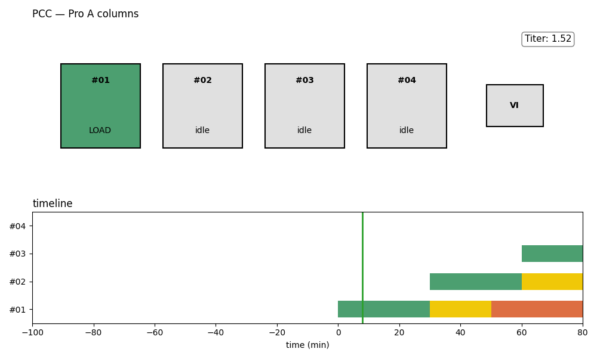

# PCC_Draw

PCC(연속 크로마토그래피, Periodic Counter-Current chromatography) 컬럼 스케줄을
**matplotlib 실시간 창에 애니메이션**으로 그리는 시각화 도구.

Protein A 컬럼 #01~#04가 시간에 따라 `LOAD → WASH → ELUTE → REGEN` 단계를 도는 모습을
깔끔한 공정 다이어그램으로 보여준다 — 컬럼 박스(현재 단계 색) + 흐름 화살표로 이어진 VI(바이러스
불활성화) 단계 + Titer 패널 + 하단 미니 간트(스윕하는 `now` 세로선).

사이클 총길이 > 위상 간격(load_duration)이라 사이클이 시간상 **겹친다** → 한 시점에 4개 컬럼이
서로 다른 단계에 동시 존재하는 PCC 특유의 계단식 움직임을 화면으로 읽힌다.

> 형제 프로젝트 [`PCC_Schedule_simulator`](https://github.com/Nocharm/PCC_Schedule_simulator)와는
> 코드가 분리돼 있다. PCC_Draw는 import·재사용 없이 단순 자체 스케줄 모델을 둔다.

## 현재 상태

**구현 완료.** 22개 테스트 통과, ruff clean. 설계 문서: [`docs/superpowers/specs/2026-06-08-pcc-draw-animation-design.md`](docs/superpowers/specs/2026-06-08-pcc-draw-animation-design.md).

## 실행

```bash
uv sync --extra dev
uv run python -m pcc_draw                 # 실시간 창 (space=정지, ↑/↓=속도)
uv run python -m pcc_draw --save demo.gif # GIF 저장
uv run python -m pcc_draw --titer 2.0 --load 25  # 파라미터 조정
```



## 구조

```
src/pcc_draw/
├── schedule.py   # 순수 모델: Phase, 고정 길이, 사이클 타임라인, state_at(t)
├── draw.py       # 한 프레임 렌더: 모델 상태 → matplotlib 도형
├── animate.py    # FuncAnimation 드라이버: 재생/일시정지/속도, --save GIF
└── __main__.py   # python -m pcc_draw 진입점
tests/            # schedule.py 단위 테스트
```

## 요구사항

Python 3.11+, `matplotlib`, `pillow` (GIF 저장 시 필요).
